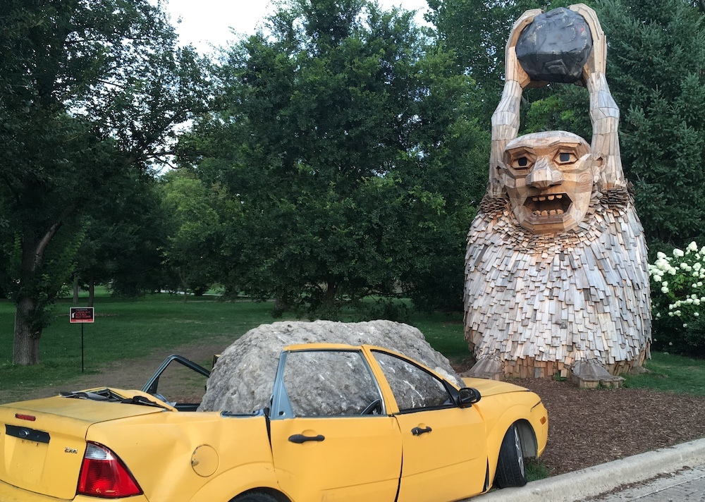

## 🔭 Current Projects
### 2023 Chicago Marathon
Training to run 26.2 next October 8th, and fundraising for the [Lisle Arboretum](https://mortonarb.org/explore/activities/exhibitions/humannature/) ('cause I didn't win the marathon lottery).  It's been 13 years since I last ran a marathon.  [Be a champion of trees with me](https://fundraisers.hakuapp.com/chris-walquist)!

Rocky Bardur versus Ford Focus. [Thomas Dambo's Trolls](https://thomasdambo.com/) were recent Lisle Arboretum guests.

From 2008...

### Volunteering at [Intrinsic High School](https://intrinsicschools.org/downtown-campus/)

I go down to Monroe and Clark for a little while on Tuesday and Friday mornings, teaching sophomores some HTML/CSS/Javascript in partnership with the excellent [CodeNation](https://codenation.org/) folks, who run the program, including providing the curriculum, fellow instructors, and classroom coordinator.

### Apprenticeship Training Manager

As part of the DRW Apprenticeship Team, I develop and deliver technical training in the basics of devops and software engineering, to junior talent from a diverse demographic who are pivoting into fintech.  The program hosts approximately 16 apprentices onsite at the Chicago office for up to a year, the goal being a fulltime position at DRW; however, employment elsewhere in tech is also a program win.

With the excellent assistance of many DRW senior tech engineers who coach apprentices 1-on-1, we partner with [Apprenti](https://apprenticareers.org/) to deliver a [registered apprenticeship program](https://www.apprenticeship.gov/).

<!--
**walquis/walquis** is a ✨ _special_ ✨ repository because its `README.md` (this file) appears on your GitHub profile.

Here are some ideas to get you started:

- 🔭 I’m currently working on ...
- 🌱 I’m currently learning ...
- 👯 I’m looking to collaborate on ...
- 🤔 I’m looking for help with ...
- 💬 Ask me about ...
- 📫 How to reach me: ...
- 😄 Pronouns: ...
- ⚡ Fun fact: ...
-->
